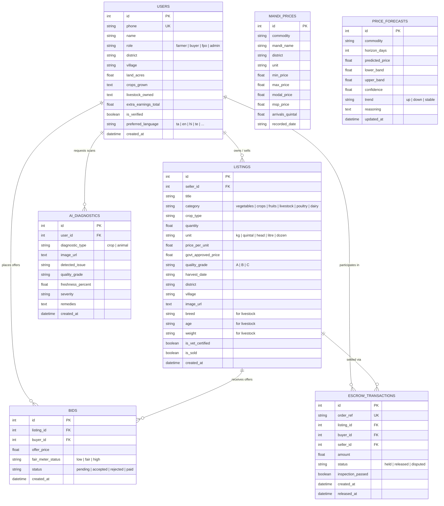

# Database Schema & Entity-Relationship Diagram: Uzhavan Thunai

```mermaid
erDiagram
    USERS ||--o{ LISTINGS : "owns / sells"
    USERS ||--o{ BIDS : "places offers"
    USERS ||--o{ AI_DIAGNOSTICS : "requests scans"
    USERS ||--o{ ESCROW_TRANSACTIONS : "participates in"
    LISTINGS ||--o{ BIDS : "receives offers"
    LISTINGS ||--o{ ESCROW_TRANSACTIONS : "settled via"

    USERS {
        int id PK
        string phone UK
        string name
        string role "farmer | buyer | fpo | admin"
        string district
        string village
        float land_acres
        text crops_grown
        text livestock_owned
        float extra_earnings_total
        boolean is_verified
        string preferred_language "ta | en | hi | te | ..."
        datetime created_at
    }

    LISTINGS {
        int id PK
        int seller_id FK
        string title
        string category "vegetables | crops | fruits | livestock | poultry | dairy"
        string crop_type
        float quantity
        string unit "kg | quintal | head | litre | dozen"
        float price_per_unit
        float govt_approved_price
        string quality_grade "A | B | C"
        string harvest_date
        string district
        string village
        text image_url
        string breed "for livestock"
        string age "for livestock"
        string weight "for livestock"
        boolean is_vet_certified
        boolean is_sold
        datetime created_at
    }

    MANDI_PRICES {
        int id PK
        string commodity
        string mandi_name
        string district
        string unit
        float min_price
        float max_price
        float modal_price
        float msp_price
        float arrivals_quintal
        string recorded_date
    }

    PRICE_FORECASTS {
        int id PK
        string commodity
        int horizon_days
        float predicted_price
        float lower_band
        float upper_band
        float confidence
        string trend "up | down | stable"
        text reasoning
        datetime updated_at
    }

    BIDS {
        int id PK
        int listing_id FK
        int buyer_id FK
        float offer_price
        string fair_meter_status "low | fair | high"
        string status "pending | accepted | rejected | paid"
        datetime created_at
    }

    ESCROW_TRANSACTIONS {
        int id PK
        string order_ref UK
        int listing_id FK
        int buyer_id FK
        int seller_id FK
        float amount
        string status "held | released | disputed"
        boolean inspection_passed
        datetime created_at
        datetime released_at
    }

    AI_DIAGNOSTICS {
        int id PK
        int user_id FK
        string diagnostic_type "crop | animal"
        text image_url
        string detected_issue
        string quality_grade
        float freshness_percent
        string severity
        text remedies
        datetime created_at
    }
```
